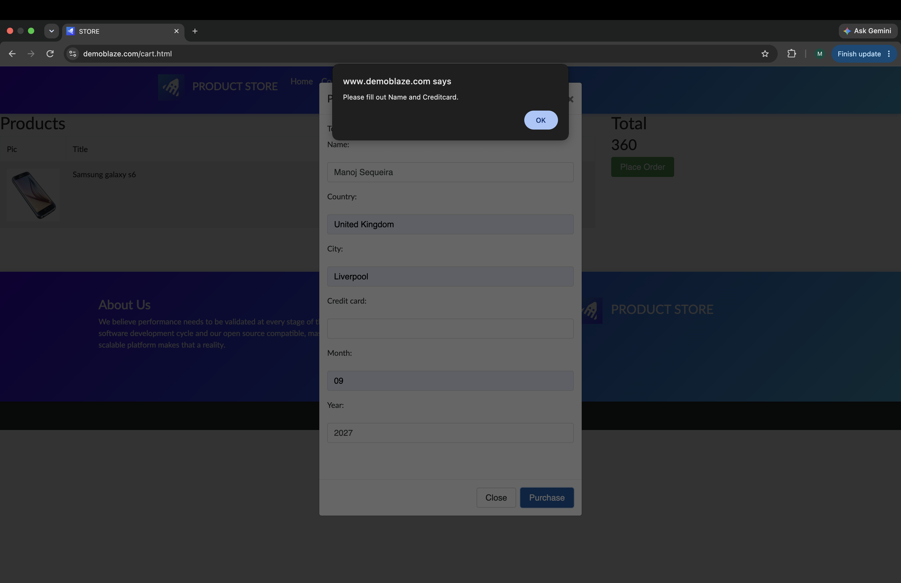

# BUG-001: Missing credit-card validation incorrectly mentions the Name field

## Summary

The purchase form displays a misleading validation message when the Name field is completed but the Credit card field is empty.

## Environment

- Application: DemoBlaze
- Page: Cart — Place Order
- Browser: Google Chrome
- Operating system: macOS
- Test case: TC-13

## Severity

Low

## Priority

Medium

## Preconditions

- A product is present in the shopping cart
- The Place Order form is open

## Steps to Reproduce

1. Enter `Manoj Sequeira` in the Name field
2. Enter valid Country and City values
3. Leave the Credit card field empty
4. Enter Month and Year values
5. Click Purchase

## Expected Result

The purchase should be prevented and the message should state that the Credit card field is required.

## Actual Result

The purchase is prevented, but the message says:

`Please fill out Name and Creditcard.`

This incorrectly suggests that the completed Name field is also empty.

## Evidence

## Status

New