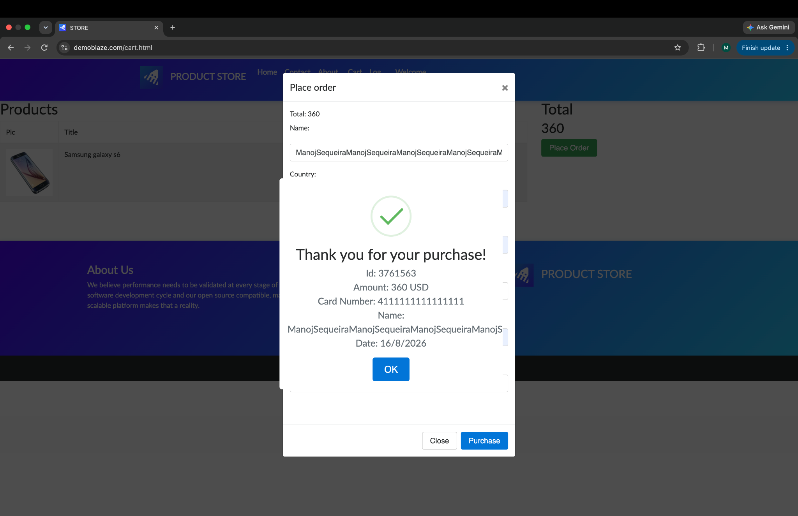

# BUG-002: Long customer name breaks the purchase confirmation layout

## Summary

A very long customer name causes the purchase confirmation content to be clipped and creates unnecessary scrollbars.

## Environment

- Application: DemoBlaze
- Page: Cart — Place Order
- Browser: Google Chrome
- Operating system: macOS
- Test case: TC-14

## Severity

Medium

## Priority

Medium

## Preconditions

- A product is present in the shopping cart
- The Place Order form is open

## Steps to Reproduce

1. Enter a name containing approximately 130 characters
2. Enter valid values in the other purchase fields
3. Click Purchase
4. Review the purchase confirmation

## Expected Result

The long name should wrap, truncate safely or be restricted to a reasonable maximum length. The confirmation content should remain readable.

## Actual Result

The customer name is clipped and scrollbars appear inside the confirmation. Parts of the information are difficult to read.

## Evidence

## Status

New