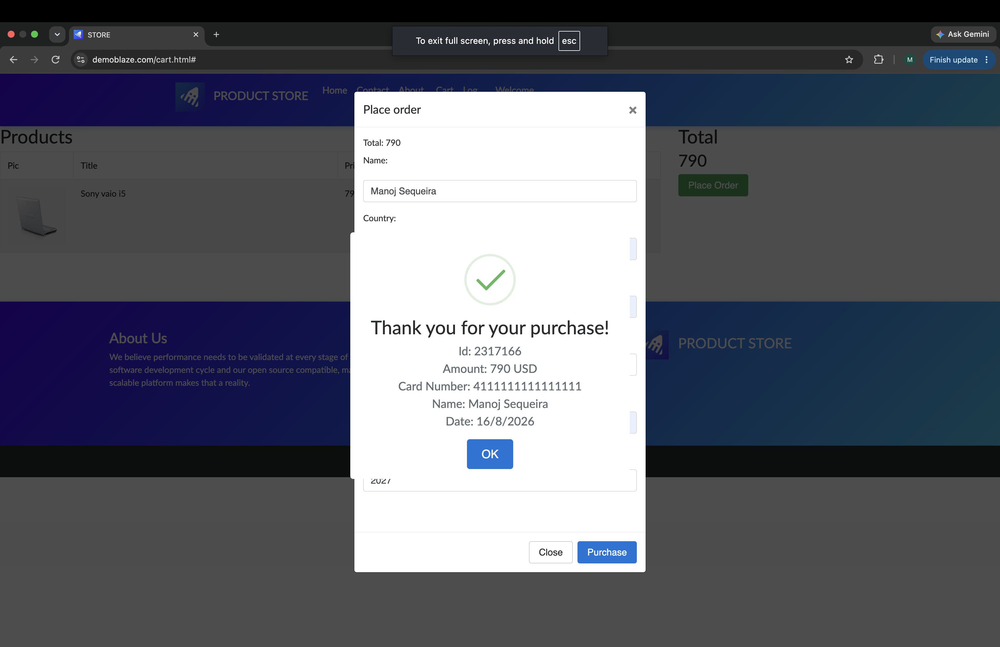

# BUG-003: Full credit-card number is exposed in purchase confirmation

## Summary

The purchase confirmation displays the customer’s complete credit-card number without masking it.

## Environment

- Application: DemoBlaze
- Page: Cart — Purchase confirmation
- Browser: Google Chrome
- Operating system: macOS
- Discovered during: TC-11

## Severity

High

## Priority

High

## Preconditions

- A product is present in the shopping cart
- The Place Order form is open

## Steps to Reproduce

1. Enter valid customer information
2. Enter a credit-card number
3. Click Purchase
4. Review the purchase confirmation

## Expected Result

The credit-card number should be hidden or masked, for example:

`************1111`

## Actual Result

The complete credit-card number is displayed in the purchase confirmation:

`4111111111111111`

This may expose sensitive payment information to people viewing the screen or captured evidence.

## Evidence

## Status

New